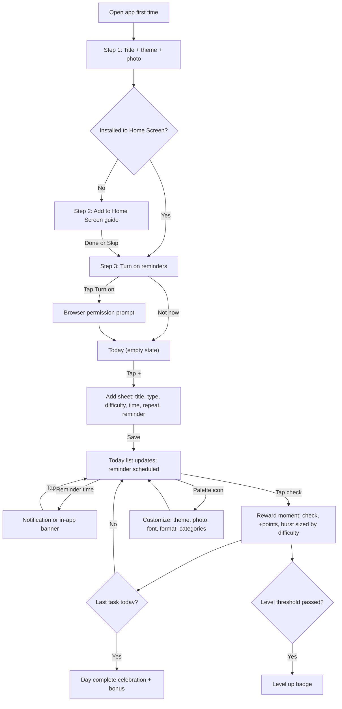

# 📐 Student Day Planner: Product Spec

> Source: Notion page https://app.notion.com/p/3e6c427ef5e081d99f7fd280fbb8a9da (path: Projects / Student Day Planner), last edited 2026-09-25T17:58:26.012Z (UTC). Fetched Sep 25, 2026. No child pages are linked from this spec; this is the complete spec.

**Version:** 1.0 · **Written:** Sep 25, 2026 (AT) · **Author:** Planner Designer (for Tyler Fennell) · **For:** Planner Builder
**Project:** Student Day Planner · **Design task due:** Oct 9, 2026 · Markdown copy on the box: `/workspace/planner-spec/planner-spec.md`
> **How to read this.** Part 1 covers what Etsy allows and which delivery format to use, with a source for each fact. Part 2 is the build spec. Any number in Part 2 (points, levels, timings, sizes) is a **design proposal**, not a fact. Tune it after testing. Facts about Etsy or browsers link to the page I read. Where I couldn't check something, I say so.
<table_of_contents/>
---
## Part 1: Etsy format research
### 1.0 A note on sources
Etsy's policy pages blocked direct fetching from my tools (HTTP 403 or timeouts). So I read them in **Internet Archive (Wayback Machine) copies** of the official Etsy pages. The snapshot date and Etsy's own "Last updated" date are listed for each one. Etsy can change these pages at any time, so **Tyler should re-read the live pages before listing**.
<table header-row="true">
<tr>
<td>Etsy page (official URL)</td>
<td>Copy I read</td>
<td>Etsy's "Last updated"</td>
</tr>
<tr>
<td>[Creativity Standards](https://www.etsy.com/legal/creativity/)</td>
<td>Wayback, Aug 28, 2026</td>
<td>Jun 10, 2025</td>
</tr>
<tr>
<td>[Services policy](https://www.etsy.com/legal/policy/services/242665313101)</td>
<td>Wayback, Dec 28, 2025 (matches Sep 2026 search snippets)</td>
<td>Jun 10, 2025</td>
</tr>
<tr>
<td>[Seller Policy](https://www.etsy.com/legal/sellers/)</td>
<td>Wayback, Sep 24, 2026</td>
<td>Sep 10, 2026</td>
</tr>
<tr>
<td>[Prohibited Items](https://www.etsy.com/legal/prohibited/)</td>
<td>Wayback, Sep 8, 2026</td>
<td>Aug 11, 2026</td>
</tr>
<tr>
<td>[Off-Platform Transactions](https://www.etsy.com/legal/policy/off-platform-transactions/1254654515806)</td>
<td>Wayback, Feb 1, 2026</td>
<td>May 6, 2024</td>
</tr>
<tr>
<td>[Help: How to Manage Your Digital Listings](https://help.etsy.com/hc/en-us/articles/115015628347-How-to-Manage-Your-Digital-Listings)</td>
<td>Wayback, Jan 13, 2026</td>
<td>not shown</td>
</tr>
<tr>
<td>[Help: What Can I Sell on Etsy?](https://help.etsy.com/hc/en-us/articles/360024112614-What-Can-I-Sell-on-Etsy)</td>
<td>Wayback, Jul 31, 2026</td>
<td>not shown</td>
</tr>
</table>
### 1.1 What counts as a digital item on Etsy
- **Digital items must be made or designed by the seller.** They can be ready-made files (instant download) or custom files sent after purchase (made-to-order). Source: [Manage Your Digital Listings](https://help.etsy.com/hc/en-us/articles/115015628347-How-to-Manage-Your-Digital-Listings), [What Can I Sell](https://help.etsy.com/hc/en-us/articles/360024112614-What-Can-I-Sell-on-Etsy).
- **Creativity Standards:** under "Designed by a seller", Etsy allows "Digital downloads of sellers' original designs: Original content created by the seller, sold as a digital download". The examples given are "A digital file of a seller's unique graphic design, audio, text document, or scanned copy of physical artwork". "A bundle, collection, scan, or PDF of someone else's work" does not qualify. Seller-prompted AI creations must say so in the listing. Source: [Creativity Standards](https://www.etsy.com/legal/creativity/).
	- *Note:* the examples don't mention software or apps. They don't ban them either. See 1.2.
- **File limits (instant download):** up to **5 files**, **20 MB max per file**. File names can be up to 70 characters (letters, numbers, periods, underscores or hyphens) and can't be renamed after upload. Variations aren't allowed on digital items. You can't publish an instant digital listing without a file. "Canceling an order is the only way to revoke a buyer's access to a file." Source: [Manage Your Digital Listings](https://help.etsy.com/hc/en-us/articles/115015628347-How-to-Manage-Your-Digital-Listings).
- **Supported file types:** .bmp, .doc, .gif, .jpeg, .jpg, .mobi, .mov, .mp3, .mpeg, .pdf, .png, .psp, .rtf, .stl, .txt, .zip, .ePUB, .iBook. Source: same page. **.html is not on Etsy's list.** One third-party blog ([Kupkaike](https://kupkaike.com/sell/etsy), seen in search results only, not fetched) says HTML is accepted. That conflicts with Etsy's own list, so **put any HTML inside a .zip**.
- **Listings must offer an item.** Seller Policy: "All listings must offer an item for sale (which includes digitally delivered items...)". Source: [Seller Policy](https://www.etsy.com/legal/sellers/).
### 1.2 Software, apps, subscriptions, templates, links, services
<table header-row="true">
<tr>
<td>Question</td>
<td>What Etsy's pages say</td>
<td>Source</td>
</tr>
<tr>
<td>Services in general</td>
<td>"In general, services are not allowed to be sold on Etsy. Only services that produce a new tangible item that meet our criteria may be sold on Etsy."</td>
<td>[Services policy](https://www.etsy.com/legal/policy/services/242665313101), [What Can I Sell](https://help.etsy.com/hc/en-us/articles/360024112614-What-Can-I-Sell-on-Etsy)</td>
</tr>
<tr>
<td>**Subscriptions / app access**</td>
<td>**Prohibited:** "Membership Subscriptions: Access to streaming platform subscriptions (e.g., Netflix or Spotify); **Access to software or app membership subscriptions (e.g., Adobe)**; Access to gaming subscriptions"</td>
<td>[Services policy](https://www.etsy.com/legal/policy/services/242665313101)</td>
</tr>
<tr>
<td>Access codes / licences</td>
<td>"In-game virtual items, accounts, characters, power-leveling or boosting services, **access codes or licenses**" are prohibited under *Virtual Gaming Assets*. That's about games, but it signals caution about selling "codes".</td>
<td>[Services policy](https://www.etsy.com/legal/policy/services/242665313101)</td>
</tr>
<tr>
<td>Coaching / tutoring</td>
<td>Prohibited: "Personal therapy, tutoring, training, coaching, and similar services"</td>
<td>[Services policy](https://www.etsy.com/legal/policy/services/242665313101)</td>
</tr>
<tr>
<td>Add-ons, gift cards, referral codes</td>
<td>Prohibited: "Add-ons with no physical item associated", "Gift cards", "Referral codes"</td>
<td>[Services policy](https://www.etsy.com/legal/policy/services/242665313101), [Seller Policy](https://www.etsy.com/legal/sellers/)</td>
</tr>
<tr>
<td>Selling standalone software or a one-time-purchase web app</td>
<td>**No explicit rule found either way.** I found no Etsy policy text that allows or bans a one-time purchase of seller-made software. The only explicit software rule is the ban on **membership subscriptions** to software or apps.</td>
<td>(absence noted after reading all pages above)</td>
</tr>
<tr>
<td>Templates for Notion / Canva / GoodNotes</td>
<td>No specific rule found. These are sold openly on Etsy as PDFs that contain a link (examples in 1.3).</td>
<td>listings in 1.3</td>
</tr>
<tr>
<td>Links to external sites</td>
<td>Off-Platform policy bans "Making offers to buy or sell outside Etsy", "Encouraging buyers to purchase an item in your Etsy shop through another venue", and "**Using a QR code to direct users off of the Etsy platform**". "A transaction initiated on Etsy may not be completed off of Etsy." Seller Policy also bans sharing "external URLs ... QR codes" in Messages **for the purpose of** off-platform transactions. **None of these pages covers a delivery link inside a purchased file**, e.g. a Notion template link or an app link.</td>
<td>[Off-Platform](https://www.etsy.com/legal/policy/off-platform-transactions/1254654515806), [Seller Policy](https://www.etsy.com/legal/sellers/)</td>
</tr>
</table>
**What this means for us (my reading, not Etsy's words):**
- ✅ Safe: a **one-time digital download** of Tyler's original design, i.e. PDF guide, original wallpapers, app files in a .zip.
- ❌ Not allowed: selling it as a **subscription or membership**. No monthly plans, no "access pass", no renewals.
- ⚠️ **Grey area:** giving access to a *hosted web app* through a link inside the purchased PDF. Etsy's policy doesn't address it. Notion template sellers do the same thing openly (1.3), but that is practice, not permission. **Not verified with Etsy.** If Tyler wants certainty, he can ask Etsy Support before launch.
- To lower the risk: sell it as a **lifetime, one-time download**. Put real original design files in the download (guide, wallpapers, offline app copy). Never sell anything else, upsell or collect payment off Etsy. **No QR codes** in listing images.
### 1.3 How "interactive/digital planner" products are actually delivered (seen in real sources)
<table header-row="true">
<tr>
<td>Product</td>
<td>Delivery format (as the page states)</td>
<td>Price shown</td>
<td>Source</td>
</tr>
<tr>
<td>Etsy: "Notion Template Extended Student Planner..." (shop TheSeekerSociety, **17.1k sales** shown)</td>
<td>"Digital file type(s): 1 PDF". Steps: "1. Purchase (Instant Download) 2. Download the PDF (Access the Template) 3. Duplicate the Template". The PDF contains a link to the Notion template.</td>
<td>\$34.95 sale (original \$49.93) in the archived page; currency symbol only, probably USD</td>
<td>Wayback copy (Dec 5, 2025) of [this listing](https://www.etsy.com/listing/1440613373/notion-template-extended-student-planner)</td>
</tr>
<tr>
<td>Etsy: "2026 Studio Ghibli Student Dashboard Notion Template" (**721 sales** shown)</td>
<td>"2 PDF". "You'll receive a downloadable zip file that includes ✔ Link to template to duplicate ✔ Instructions". "Lifetime access".</td>
<td>\$10.70</td>
<td>Wayback copy (Aug 7, 2026) of [this listing](https://www.etsy.com/listing/1540048079/2026-studio-ghibli-student-dashboard)</td>
</tr>
<tr>
<td>Etsy: NozomuNoto "Academic Digital Planner 2026-2027"</td>
<td>"interactive PDF files" for GoodNotes, Notability and similar apps</td>
<td>not captured</td>
<td>**Search-result snippet only** (page not fetched): [listing](https://www.etsy.com/uk/listing/1599669312/digital-planner-academic-portrait-2025)</td>
</tr>
<tr>
<td>Passion Planner (not on Etsy, for comparison)</td>
<td>"a hyperlinked PDF designed to work in note-taking apps like Goodnotes, Notability, or Xodo". Reminders are handled by an "Add to Calendar feature ... Uses Apple Shortcut feature to add a new event or reminder".</td>
<td>\$40</td>
<td>[passionplanner.com product page](https://passionplanner.com/products/digital-student-planner-2026-2027-tranquil-hues)</td>
</tr>
</table>
Also seen: a Reddit post titled "New shop selling a wedding planner web app" on r/EtsySellers (search result only, not fetched), so at least one seller is trying the web-app-on-Etsy model. I couldn't check whether that listing is still live.
### 1.4 Which formats can send on-time reminders?
<table header-row="true">
<tr>
<td>Format</td>
<td>On-time reminders?</td>
<td>Evidence</td>
</tr>
<tr>
<td>Hyperlinked PDF (GoodNotes/Notability)</td>
<td>**No.** A PDF is a static document. The best workaround seen is sending events to the phone calendar with Apple Shortcuts (Passion Planner).</td>
<td>[Passion Planner page](https://passionplanner.com/products/digital-student-planner-2026-2027-tranquil-hues)</td>
</tr>
<tr>
<td>Notion template</td>
<td>**Yes, through Notion's own app.** Reminders on Date properties or `@remind`. Push notifications in Notion's desktop and mobile apps, and "If Notion isn't open at the time of the reminder, both a mobile push notification and an email will be sent." The buyer needs a Notion account. Recurring reminders: "Not at the moment".</td>
<td>[Notion Help: Reminders](https://www.notion.com/help/reminders)</td>
</tr>
<tr>
<td>Google Sheets</td>
<td>**Not really.** Built-in notifications are emails about *edits by others* or form submissions, not scheduled reminders. Anything more needs Apps Script.</td>
<td>[Google Docs Editors Help: Manage notifications](https://support.google.com/docs/answer/91588)</td>
</tr>
<tr>
<td>**Web app / PWA, while open**</td>
<td>**Yes.** The Notifications API shows system notifications once the user grants permission. Permission should be requested from a user gesture (a tap). Chrome and Firefox require HTTPS. On mobile, use `ServiceWorkerRegistration.showNotification()`, because the `Notification()` constructor "will throw a TypeError" on most mobile browsers.</td>
<td>[MDN: Using the Notifications API](https://developer.mozilla.org/en-US/docs/Web/API/Notifications_API/Using_the_Notifications_API)</td>
</tr>
<tr>
<td>**Web app / PWA, while closed**</td>
<td>**Only with a push server.** The Push API lets apps "receive messages pushed to them from a server, whether or not the web app is in the foreground, or even currently loaded". Baseline across browsers since March 2023. There is **no shipped way to schedule a local notification in advance**: Chrome's Notification Triggers API "has ended". The same page notes that push delivery can be delayed by "network connectivity or battery-preserving features like doze mode".</td>
<td>[MDN: Push API](https://developer.mozilla.org/en-US/docs/Web/API/Push_API), [Chrome: Notification Triggers](https://developer.chrome.com/docs/web-platform/notification-triggers)</td>
</tr>
<tr>
<td>**iPhone/iPad**</td>
<td>**Only after "Add to Home Screen"** (iOS/iPadOS 16.4+). WebKit: "we are adding support for Web Push to **Home Screen web apps**". The app "can request permission ... as long as that request is in response to direct user interaction". Notifications then show on the Lock Screen, in Notification Center and on Apple Watch, and work with Focus. No Apple Developer Program membership needed. Apple Support confirms that a web app opened from the Home Screen can "receive notifications".</td>
<td>[WebKit: Web Push for Web Apps on iOS and iPadOS](https://webkit.org/blog/13878/web-push-for-web-apps-on-ios-and-ipados/), [Apple Support: Turn a website into an app](https://support.apple.com/guide/iphone/open-as-web-app-iphea86e5236/ios)</td>
</tr>
</table>
**Data storage on iPhone.** In Safari, WebKit deletes "all of a website's script-writable storage after seven days of Safari use without user interaction on the site". That includes IndexedDB and LocalStorage. Home Screen web apps "have their own counter of days of use" and WebKit does "not expect the first-party in such a web application to have its website data deleted" ([WebKit, 2020](https://webkit.org/blog/10218/full-third-party-cookie-blocking-and-more/)). Origins can ask for persistent storage with `navigator.storage.persist()`. WebKit grants it based on things like "whether the website is opened as a Home Screen Web App" ([WebKit: Updates to Storage Policy, 2023](https://webkit.org/blog/14403/updates-to-storage-policy/)). → **On iPhone, installing to the Home Screen protects the planner's data as well as enabling reminders.**
### 1.5 Recommendation
**Recommended: a no-account installable web app (PWA), sold on Etsy as a one-time instant digital download.**
- **The Etsy download (.zip plus PDF, within 5 files / 20 MB each):**
	1. `Start-Here.pdf`: welcome, the app link (a plain tappable link, **no QR code**), and 3-step install instructions for iPhone, Android and laptop.
	2. `Wallpaper-Pack.zip`: 6-10 original background images designed by Tyler, sized for phones. This is a real original-design deliverable.
	3. `Quick-Guide.pdf`: one page covering how points, levels and streaks work, and how to back up.
	4. *(Nice to have)* `Planner-Offline.zip`: the app's own files. Buyers own a copy even if hosting changes. Note: opened as a local file it runs as a basic planner only. No install, no notifications (service workers need HTTPS).
- **App:** plain HTML/CSS/JS, hosted free (GitHub Pages or Cloudflare Pages). Data stays on the device. Reminders work in three tiers (Part 2, section 4).
**Why:** it's the only format that meets all of Tyler's must-haves at once: on-time reminders, points/levels/streaks with animation, the user's own background photos, and a very simple UI. PDF, Notion and Sheets each miss at least two of these.
**Fallbacks:**
- **Fallback 1: hyperlinked PDF planner (GoodNotes/Notability).** Lowest Etsy risk, since a plain original-design download is clearly allowed. Proven format (1.3). No hosting. **But** no real reminders (only calendar hand-off with Shortcuts), no automatic points or levels, and it needs a separate note app. Use this if Etsy says no to the web-app link, or as a cheap second product.
- **Fallback 2: Notion template.** Real reminders through Notion (push and email). Proven on Etsy (1.3). **But** the buyer needs a Notion account, the UI isn't "instantly understandable", and gamification with custom photo backgrounds is weak. I didn't research Notion formula limits.
**Honest risks and trade-offs of the recommendation:**
1. **Etsy grey area.** No policy text covers access to a hosted app through a link in the PDF (1.2). Mitigate: one-time only, real design files in the download, no subscription wording, no off-Etsy selling. Optionally ask Etsy Support.
2. **Access can't really be restricted to buyers.** With no accounts and static hosting, anyone who has the link can use the app. A shared "unlock word" in the PDF only stops casual discovery, and Etsy's ban on game "access codes or licenses" suggests keeping codes out of it. **Recommendation: don't gate in the MVP.** Use an unlisted URL (no search indexing), keep the price fair, and accept some sharing.
3. **Closed-app reminders need a small push server.** Reminder times, and the task names unless the user turns them off, leave the device. That weakens the "everything stays on your phone" promise. See Open Question 1.
4. **iPhone users must install to the Home Screen** for reminders and safe storage. This is a real setup step, so the first-run flow is built around it.
5. **Local-only data** can be lost if the user clears browser data or changes phones. Mitigate with a one-tap backup/restore and gentle reminders to back up.
6. **Hosting dependence.** If the site goes down, installed apps keep working offline (service worker cache), but new installs don't. The offline .zip copy helps.
---
## Part 2: The spec
### 1. Product summary and target user
A calm, very simple day planner for students. Open it, see today, tap to add a class or task, and get a nudge before it starts. Checking things off feels good: points, a level bar, a streak, and a little celebration, bigger for harder tasks. When the day is done, you get a "day complete" moment. Users can make it their own with a title, colours, fonts and their own photo as the background. **Target user:** high school and college students (and anyone) who want a planner that takes 10 seconds to use and makes finishing things satisfying. It runs as a no-account app on phone, tablet or laptop, bought once on Etsy.
### 2. Screens and flows
**Principle:** one main screen, one pop-up sheet, one settings screen, plus a 3-step first run. No menus inside menus.
#### 2.0 First-run setup (3 steps, shown once; each skippable except step 1)
<table header-row="true">
<tr>
<td>Step</td>
<td>Purpose</td>
<td>What's on it</td>
<td>Interactions</td>
<td>Notes</td>
</tr>
<tr>
<td>**1. Make it yours**</td>
<td>Personalise in 10 seconds</td>
<td>Big title field ("My Day", editable), 6 theme swatches, "Add a photo" (optional), Continue</td>
<td>Tap swatch → instant live preview</td>
<td>Name is optional; default title "My Day".</td>
</tr>
<tr>
<td>**2. Put it on your Home Screen**</td>
<td>Install (needed for iPhone reminders and safe storage)</td>
<td>Detects device. **iPhone/iPad Safari:** 3 illustrated steps: tap Share → "Add to Home Screen" → turn on "Open as Web App" → Add ([Apple Support](https://support.apple.com/guide/iphone/open-as-web-app-iphea86e5236/ios)). **Android/Chrome/desktop:** an "Install app" button when the browser offers an install prompt; otherwise simple menu instructions. **Already installed** (standalone mode): step auto-skips.</td>
<td>"I did it" / "Skip for now"</td>
<td>If skipped on iPhone, show one line: "Reminders and saving work best from your Home Screen." Keep a small "Install" row in Customize.</td>
</tr>
<tr>
<td>**3. Turn on reminders**</td>
<td>Notification permission</td>
<td>One sentence: "Want a nudge before classes and tasks?", **"Turn on reminders"** button, "Not now" link, and a toggle "Morning check-in at 8:00" (off by default)</td>
<td>The permission request fires **only on the button tap** (required by WebKit and MDN). If granted and push is available → create the push subscription.</td>
<td>iPhone not installed: button is disabled with the text "Add to Home Screen first to get reminders on iPhone."</td>
</tr>
</table>
After setup → Today screen with a friendly empty state.
#### 2.1 Today (main screen)
- **Purpose:** see and finish today's plan.
- **Top area (over the background photo, with scrim):** title (e.g. "Tyler's Day"), date ("Fri, Sep 25"), a **level ring** (level number inside, ring = progress to next level), **streak chip** (🔥 5), **today's points** (+45). Tap the level ring to open a small Progress sheet (total points, level, best streak, this week's days completed).
- **Daily goal bar** (optional, on by default): "3 of 5 done" as a slim progress bar.
- **Missed reminders card** (only if any): "While you were away" (see 4.4).
- **Task list** (List format, default): cards sorted by time. Untimed tasks go under a "Anytime" divider. Each card shows a round check button, title, time (if any), category dot/emoji, and a small difficulty tag (Easy / Medium / Hard). Done tasks move to a collapsed "Done (3)" section at the bottom.
- **Timeline format** (optional toggle in Customize): a vertical hour rail from the earliest to latest task (default 7:00–22:00), cards placed at their times, a "now" line, and untimed tasks in a strip on top.
- **Big "+" button** (bottom right) → Add sheet.
- **Customize button** (top right, a small palette icon).
- **Date switcher:** swipe left/right or tap the date to pick another day (plan tomorrow). Only Today gets celebrations.
- **Key interactions:** tap check = complete (reward moment). Tap card = edit sheet. Long-press or swipe left = "Move to tomorrow" / "Delete". Undo toast for 5 seconds after complete, delete or move.
- **Empty state (no tasks today):** one illustration-free line plus a button: "Nothing planned yet. Add your first class or task." → \[+ Add\]. Evening empty state: "Plan tomorrow?" → opens tomorrow.
- **All done state:** see 3.5.
#### 2.2 Add / Edit sheet (a bottom sheet, not a new page)
- **Fields, in order (only the first is required):**
	1. **What?** Title text (autofocus). Placeholder cycles: "Biology 101", "Finish essay intro", "Gym".
	2. **Type:** category chips (Class, Study, Task, Personal, Goal, plus user categories).
	3. **How hard?** 3 big chips: Easy · Medium · Hard (default **Medium** for Class, **Easy** otherwise). Show points under each (+5 / +10 / +20).
	4. **When?** Time (optional) and duration (optional; default 50 min for Class, none otherwise).
	5. **Repeat:** Never · Every day · Weekdays · Pick days (M T W T F S S). Classes default to "Pick days".
	6. **Remind me:** At start · 5 · 10 · 15 · 30 · 60 min before · Off (default from settings: **10 min before**). Hidden if no time is set.
	7. **Note** (optional, one line, e.g. "Room 204").
- **Buttons:** Save (primary), Cancel. In edit mode: Delete (text button), and "This day only / All repeats" when editing a repeating item.
- **Quick-add shortcut:** typing a title and pressing Enter saves with the defaults (fast path).
#### 2.3 Customize (settings screen)
Grouped, short list. Every change previews live.
- **Look:** Title · Theme (6) · Text colour and background colour (20 swatches each, one scrolling row, plus a colour picker) · Accent colour (8 tested swatches) · Background photo (add/change/remove, crop, scrim Auto/Dark/Light, blur 0–12) · Font (4) · Format (List / Timeline) · Celebrations (Full / Subtle / Off) · Sound (on/off, **default off**).
- **Plan:** Categories (rename, colour, emoji, add up to 8 total) · Daily goal (Off / number of tasks / points target) · Streak counts on (Every day / Weekdays only) · Day starts at (default 4:00 AM) · Week starts on (Mon/Sun) · 12h/24h.
- **Reminders:** status line ("On", "Off", or "Needs Home Screen install") · Default lead time · Show task names in notifications (on/off) · Morning check-in (time) · Test reminder button.
- **Your data:** Back up now (download file) · Restore from backup · Last backup date · Erase everything (double confirm).
- **About:** version, "Install app" (if not installed), Help (opens the in-app quick guide), privacy note.
#### 2.4 Core flows

- **Adding 3 college classes (example):** "+" → "Biology 101" → Class → Medium → 9:00 → Repeat M/W/F → Remind 10 min → Save. Repeat for the other two. On class days all three appear automatically.
- **Completing (reward moment):** tap check → animation and points (3.4) → card slides to Done → if it was the last one, "Day complete" (3.5).
- **Editing:** tap card → sheet with values filled in → change → Save. For repeating items, ask "Just today / All".
- **Customizing:** palette icon → change → live preview → back arrow (auto-saved).
### 3. Reward and levelling system *(all numbers are design proposals)*
#### 3.1 Difficulty and points
<table header-row="true">
<tr>
<td>Difficulty</td>
<td>Points</td>
<td>Burst size</td>
<td>Default for</td>
</tr>
<tr>
<td>Easy</td>
<td>**+5**</td>
<td>small sparkle</td>
<td>Task, Personal, Goal</td>
</tr>
<tr>
<td>Medium</td>
<td>**+10**</td>
<td>burst</td>
<td>Class</td>
</tr>
<tr>
<td>Hard</td>
<td>**+20**</td>
<td>confetti</td>
<td>(user chooses)</td>
</tr>
</table>
Bonuses: **Day complete +10** (once per day, only when there were at least 2 tasks). **Daily goal reached +5** (if a goal is set). **Streak milestones** (3, 7, 14, 30, 60, 100 days): +15, +25, +40, +75, +120, +200.
#### 3.2 Levels (cumulative points)
<table header-row="true">
<tr>
<td>Level</td>
<td>Points needed</td>
<td>Level</td>
<td>Points needed</td>
</tr>
<tr>
<td>1</td>
<td>0</td>
<td>6</td>
<td>400</td>
</tr>
<tr>
<td>2</td>
<td>40</td>
<td>7</td>
<td>550</td>
</tr>
<tr>
<td>3</td>
<td>100</td>
<td>8</td>
<td>730</td>
</tr>
<tr>
<td>4</td>
<td>180</td>
<td>9</td>
<td>940</td>
</tr>
<tr>
<td>5</td>
<td>280</td>
<td>10</td>
<td>1,180</td>
</tr>
<tr>
<td>11+</td>
<td>+300 per level (11 = 1,480; 12 = 1,780; ...)</td>
<td></td>
<td></td>
</tr>
</table>
Level titles (small text under the ring): 1–4 **Starter**, 5–9 **Steady**, 10–14 **Focused**, 15–19 **Unstoppable**, 20+ **Legend**.
*Pacing check:* a typical day (3 Medium classes + 1 Hard + 1 Easy + day-complete bonus) = 65 points. That's Level 2 on day 1, Level 5 around day 5, Level 10 around day 18, then a new level every \~4–5 days.
#### 3.3 Streaks
- **A day "counts"** when **at least 1 task** is completed that day. Not all tasks: finishing something is enough.
- **Day boundary:** the day ends at **4:00 AM local time** (configurable), so late-night studying still counts for "today".
- **Weekdays-only mode:** if chosen, Saturdays and Sundays neither count nor break the streak.
- **Grace (rest day):** the user gets **1 automatic rest day per week** (Mon–Sun). A missed day uses it and the streak continues (shown as a 🌙 on that day in the Progress sheet). A second miss in the same week resets the streak.
- **Reset is quiet:** no pop-up. The chip just shows 🔥 0. **Best streak is kept forever** and shown in Progress.
#### 3.4 Completion moment (every task)
1. The check circle fills with the accent colour and a checkmark draws in (≈200 ms).
2. "+10" floats up from the check and fades (≈600 ms). The today-points counter ticks up. The level ring fills a little.
3. Burst sized by difficulty: Easy ≈ 8 soft sparkles; Medium ≈ 16-particle burst; Hard ≈ 40 confetti pieces falling for ≈1.2 s, plus a slightly bigger ring pulse.
4. Optional short vibration **where the browser supports it** (don't rely on it). Optional soft "pop" sound if Sound is on.
5. Card slides into "Done". An Undo toast appears for 5 s; Undo reverses the points.
- **Celebrations = Subtle:** only steps 1–2. **Off:** only step 1. **Reduced motion** (OS setting, detected with `prefers-reduced-motion`, [MDN](https://developer.mozilla.org/en-US/docs/Web/CSS/@media/prefers-reduced-motion)): no particles or movement, just a colour glow on the check and the points text fading in.
#### 3.5 "Day complete" moment
When the last open task for today is checked (and today had at least 2 tasks): a soft full-screen confetti (≤1.5 s), then a centred card: **"Day complete! 🎉"** · "+10 bonus" · "🔥 6-day streak" · button **"Nice"**. Shown **once per day**. Adding and finishing more tasks later gives normal rewards only. Today then shows a calm done state: "All done for today. Rest up." plus a small "Plan tomorrow" link.
#### 3.6 Level-up moment
A badge pops over the ring: **"Level 5 · Steady"** with a ring refill animation (≈1 s). Tap to dismiss, or it auto-hides after 3 s.
#### 3.7 Anti-frustration rules (must follow)
- **Never take points away** for missing or skipping. The only deduction is undoing a completion.
- **Levels never go down.**
- **No red "overdue" shaming.** Past-time unfinished tasks stay in the list in normal colours with a small neutral "earlier" label and a one-tap "Move to tomorrow".
- **No guilt copy.** Never "You failed", "You broke your streak" or "You missed X". See the tone guide (6.8).
- **No nagging.** At most 1 reminder per task, plus the optional morning check-in. No "come back" pushes.
- Points are given **once per task per day**. Editing difficulty after completion re-adjusts the points silently.
### 4. Reminders
#### 4.1 What gets a reminder
- Any task **with a time** → reminder at *time − lead*. Default lead: **10 minutes** (global setting; per-task override: at start, 5, 10, 15, 30, 60, off).
- Tasks without a time → no reminder.
- **Morning check-in** (optional, off by default, default 8:00): "Here's your day: 4 things planned."
- Content: **title** = task name (or "Coming up" if task names are hidden) · **body** = "Starts 10:30 · Room 204".
- **Snooze:** in-app banner buttons "Done" / "Snooze 10 min" (plus 5 / 30 via a long-press menu). Notification action buttons are a *progressive enhancement*: add "Done" and "Snooze" actions where supported. **I didn't verify action-button support on iOS**, so tapping the notification must always open the app with that task highlighted and Done/Snooze buttons visible.
- Times are stored as local wall-clock time plus time zone. If the device time zone changes, recompute and re-sync upcoming reminders.
#### 4.2 Case A: app is open (any device, no server)
- A scheduler checks every 30 s (and on `visibilitychange`) for reminders that are due.
- When due: show an **in-app banner** at the top (title, time, Done / Snooze). Also show a **system notification** via `registration.showNotification()` if permission is granted ([MDN](https://developer.mozilla.org/en-US/docs/Web/API/Notifications_API/Using_the_Notifications_API)). Play a soft sound only if Sound is on.
#### 4.3 Case B: app is closed, push enabled (needs a small push server)
- When the user turns on reminders (and push is supported), the app subscribes with `PushManager.subscribe()` ([MDN Push API](https://developer.mozilla.org/en-US/docs/Web/API/Push_API)). It then sends the server: the subscription plus a list of upcoming reminders `{id, fireAtUTC, title|generic}` for the next **7 days**. It re-syncs whenever tasks change and once a day when opened.
- The server sends each push at `fireAtUTC`. The service worker's `push` handler calls `showNotification()`.
- **Privacy defaults:** the server stores only the subscription endpoint, fire times and the notification text. It deletes each reminder after sending and deletes everything when the user turns reminders off. With **"Show task names" off**, the server only gets generic text ("You have something coming up").
- **iPhone/iPad:** works only on iOS/iPadOS 16.4+ **after Add to Home Screen**, and permission must follow a tap ([WebKit](https://webkit.org/blog/13878/web-push-for-web-apps-on-ios-and-ipados/)).
- **Delivery isn't guaranteed to the second.** Push can be delayed by the network or battery saving ([Chrome for Developers](https://developer.chrome.com/docs/web-platform/notification-triggers)). The UI should say "reminders usually arrive on time" rather than promise exact timing.
- **Server choice:** builder's call (any small always-on or cron-capable free host). **I didn't verify any provider's free-tier limits.** Builder should confirm before choosing.
#### 4.4 Case C: notifications off, not installed, offline, or push not available
- The app still tracks reminders locally. On next open it shows a **"While you were away" card** at the top of Today, listing missed reminders (max 5, newest first) with **Done**, **Move to later** and **Dismiss** buttons. "Dismiss all" clears the card.
- Customize → Reminders shows the plain-language status and how to fix it:
	- "Reminders are off. Turn on" (button, if permission is still "default")
	- "Blocked in browser settings" (if "denied"): show short instructions; never nag
	- "On iPhone, add to Home Screen to get reminders" (iOS, not installed)
	- "Only while the app is open" (permission granted but push unavailable)
- The optional home-screen app badge (Badging API, supported on iOS Home Screen web apps per [WebKit](https://webkit.org/blog/13878/web-push-for-web-apps-on-ios-and-ipados/)) is **Later**, not MVP.
#### 4.5 Platform limits summary (cited)
<table header-row="true">
<tr>
<td>Situation</td>
<td>Works?</td>
<td>Source</td>
</tr>
<tr>
<td>Any modern browser, app open, permission granted</td>
<td>Yes (system and in-app)</td>
<td>[MDN Notifications](https://developer.mozilla.org/en-US/docs/Web/API/Notifications_API/Using_the_Notifications_API)</td>
</tr>
<tr>
<td>App closed, Android/desktop browser, with push server</td>
<td>Yes, may be delayed</td>
<td>[MDN Push](https://developer.mozilla.org/en-US/docs/Web/API/Push_API), [Chrome](https://developer.chrome.com/docs/web-platform/notification-triggers)</td>
</tr>
<tr>
<td>App closed, **iPhone in a Safari tab**</td>
<td>**No**</td>
<td>[WebKit](https://webkit.org/blog/13878/web-push-for-web-apps-on-ios-and-ipados/) (push is for Home Screen web apps)</td>
</tr>
<tr>
<td>App closed, iPhone **Home Screen app**, iOS 16.4+, with push server</td>
<td>Yes</td>
<td>[WebKit](https://webkit.org/blog/13878/web-push-for-web-apps-on-ios-and-ipados/)</td>
</tr>
<tr>
<td>Scheduling a local notification in advance with no server</td>
<td>**No** (API development ended)</td>
<td>[Chrome: Notification Triggers](https://developer.chrome.com/docs/web-platform/notification-triggers)</td>
</tr>
<tr>
<td>App opened from a local file (offline .zip copy)</td>
<td>No notifications (Chrome/Firefox need a secure context, i.e. HTTPS); service workers also need HTTPS (not separately cited)</td>
<td>[MDN Notifications](https://developer.mozilla.org/en-US/docs/Web/API/Notifications_API/Using_the_Notifications_API) (HTTPS note)</td>
</tr>
</table>
### 5. Customization options
<table header-row="true">
<tr>
<td>Option</td>
<td>Choices (MVP)</td>
<td>Details</td>
</tr>
<tr>
<td>**Title**</td>
<td>Free text, up to 30 characters</td>
<td>Default "My Day". Optional name ("Tyler's Day").</td>
</tr>
<tr>
<td>**Theme**</td>
<td>6 presets (6.1)</td>
<td>Sets background, surface, text and accent. Choosing a theme clears a custom text or background colour so the preset shows.</td>
</tr>
<tr>
<td>**Text colour**</td>
<td>20 swatches, plus a colour picker</td>
<td>One horizontal row. Empty means the theme text. If text and background (or a photo plus its dimming) fall under 4.5:1, Customize shows “These colours are hard to read.” and **Fix it** stores the nearest readable shade.</td>
</tr>
<tr>
<td>**Background colour**</td>
<td>20 swatches, plus a colour picker</td>
<td>Solid colour behind the day, in addition to a photo. One horizontal row. Empty means the theme background.</td>
</tr>
<tr>
<td>**Accent colour**</td>
<td>8 swatches</td>
<td>Pre-tested so the label on the accent clears 4.5:1 (white or #12131A).</td>
</tr>
<tr>
<td>**Background photo**</td>
<td>Own photo or one from the wallpaper pack</td>
<td>**Upload:** `<input type="file" accept="image/*">`. **Crop:** pan and pinch-zoom to screen shape, with a Reset button. **Store:** resize to max 1600 px on the long edge, JPEG \~80%, saved in IndexedDB. **Readability:** automatic scrim over the photo (Auto picks Dark or Light from the photo's average brightness; user can override). Dark scrim = black at **60%** opacity (worst case white text on #666666 = 5.74:1). Light scrim = white at **70%** (worst case #1E2030 text on #B2B2B2 = 7.59:1). Optional blur 0–12 px. Task cards always sit on a **92% opaque** surface, so body text never sits directly on the photo.</td>
</tr>
<tr>
<td>**Font**</td>
<td>4: Nunito (default), Inter, Lexend, Caveat (titles only)</td>
<td>See 6.2.</td>
</tr>
<tr>
<td>**Categories / goal types**</td>
<td>Defaults: Class 📚, Study ✏️, Task ✅, Personal 🌱, Goal 🎯</td>
<td>Rename, emoji, colour (from the 8 swatches), add up to 8 total.</td>
</tr>
<tr>
<td>**Daily goal**</td>
<td>Off / "Finish N tasks" / "Earn N points"</td>
<td>Shown as the slim bar on Today.</td>
</tr>
<tr>
<td>**Format**</td>
<td>List (default) / Timeline</td>
<td>Timeline hours auto-fit to tasks.</td>
</tr>
<tr>
<td>**Celebrations**</td>
<td>Full / Subtle / Off</td>
<td>Reduced-motion OS setting always wins.</td>
</tr>
<tr>
<td>**Sound**</td>
<td>On / Off (default Off)</td>
<td>One soft completion sound and one reminder chime. Short, original or public-domain audio; builder to confirm the licence.</td>
</tr>
<tr>
<td>**Streak days**</td>
<td>Every day / Weekdays only</td>
<td></td>
</tr>
<tr>
<td>**Time format, week start, day start**</td>
<td>12h/24h · Mon/Sun · default 4:00 AM</td>
<td></td>
</tr>
</table>
### 6. Visual style guide
#### 6.1 Colour palettes (hex; contrast ratios computed with the WCAG formula)
WCAG 2.2 AA requires **4.5:1** for normal text and **3:1** for large text (≥18 pt, or 14 pt bold ≈ 24 px / 18.5 px) ([W3C Understanding 1.4.3](https://www.w3.org/WAI/WCAG22/Understanding/contrast-minimum.html)). It requires **3:1** for UI component boundaries and icons ([W3C Understanding 1.4.11](https://www.w3.org/WAI/WCAG22/Understanding/non-text-contrast.html)). All pairs below were computed by me and pass AA for normal text.
<table header-row="true">
<tr>
<td>Theme</td>
<td>Background</td>
<td>Surface (cards)</td>
<td>Text</td>
<td>Muted text</td>
<td>Accent (buttons, checks)</td>
<td>Text on accent</td>
<td>Ratios: text/bg · muted/surface · on-accent</td>
</tr>
<tr>
<td>**Calm (default)**</td>
<td>#E4DEFF</td>
<td>#FFFFFF</td>
<td>#2A1860</td>
<td>#533C86</td>
<td>#6D4AFF</td>
<td>#FFFFFF</td>
<td>11.6 · 8.9 · 5.2</td>
</tr>
<tr>
<td>Mint</td>
<td>#C8FFE6</td>
<td>#FFFFFF</td>
<td>#064536</td>
<td>#1B6B56</td>
<td>#00B894</td>
<td>#12131A</td>
<td>9.9 · 6.4 · 7.3</td>
</tr>
<tr>
<td>Sunset</td>
<td>#FFE0C2</td>
<td>#FFFFFF</td>
<td>#5C2208</td>
<td>#8A4030</td>
<td>#FF4D1A</td>
<td>#12131A</td>
<td>9.9 · 7.4 · 5.6</td>
</tr>
<tr>
<td>Ocean</td>
<td>#D2EFFF</td>
<td>#FFFFFF</td>
<td>#062E52</td>
<td>#1E5680</td>
<td>#0084FF</td>
<td>#12131A</td>
<td>11.5 · 7.8 · 5.1</td>
</tr>
<tr>
<td>Blossom</td>
<td>#FFD4E8</td>
<td>#FFFFFF</td>
<td>#6A1040</td>
<td>#8E3A62</td>
<td>#FF2D87</td>
<td>#12131A</td>
<td>9.0 · 7.2 · 5.3</td>
</tr>
<tr>
<td>Night (dark)</td>
<td>#16142B</td>
<td>#2A2744</td>
<td>#F6F4FF</td>
<td>#C8C2EE</td>
<td>#38BDF8</td>
<td>#12131A</td>
<td>16.5 · 8.4 · 8.7</td>
</tr>
</table>
**Shared colours:** Done/success #15803D (5.0:1 on white; use #5DFFB0 in Night). **Difficulty tags** (white text on the tag): Easy #15803D (5.0:1) · Medium #B45309 (5.0:1) · Hard #B91C1C (6.5:1). Always pair colour with the word (Easy/Medium/Hard), never colour alone.
**Accent swatches:** #6D4AFF, #00C2A8, #FF4D1A, #1A8CFF, #FF2D87, #38BDF8, #7C3AED, #00B4D8. Pair each with white or #12131A, whichever clears 4.5:1. **Text and background rows** are the 20 swatches in `TEXT_COLOURS` and `BG_COLOURS`, then a native colour input. A v1 settings row (schemaVersion 1, no text or background field) loads as schemaVersion 2 with those fields empty, so the saved theme id and accent stay.
#### 6.2 Typography (all free, open-licence fonts from Google Fonts)
<table header-row="true">
<tr>
<td>Use</td>
<td>Font</td>
<td>Licence / source</td>
</tr>
<tr>
<td>Default UI and titles</td>
<td>**Nunito** (rounded, friendly)</td>
<td>OFL, [Google Fonts](https://fonts.google.com/specimen/Nunito), [metadata](https://github.com/google/fonts/blob/main/ofl/nunito/METADATA.pb)</td>
</tr>
<tr>
<td>Alternative: clean</td>
<td>**Inter**</td>
<td>OFL, [Google Fonts](https://fonts.google.com/specimen/Inter), [metadata](https://github.com/google/fonts/blob/main/ofl/inter/METADATA.pb)</td>
</tr>
<tr>
<td>Alternative: easy reading</td>
<td>**Lexend**</td>
<td>OFL, [Google Fonts](https://fonts.google.com/specimen/Lexend), [metadata](https://github.com/google/fonts/blob/main/ofl/lexend/METADATA.pb)</td>
</tr>
<tr>
<td>Title only: handwritten</td>
<td>**Caveat** (never for body text)</td>
<td>OFL, [Google Fonts](https://fonts.google.com/specimen/Caveat), [metadata](https://github.com/google/fonts/blob/main/ofl/caveat/METADATA.pb)</td>
</tr>
</table>
**Self-host the font files** (bundle them with the app) so the app works offline and makes no third-party requests. The OFL licence is listed in each font's metadata. The builder should include the OFL text in the app's About/licences.
**Type scale (px, size/line-height):** Title 28/34 bold · Section 20/26 semibold · Body 17/24 regular · Small 14/20 · Points and level numbers use tabular figures. Minimum text size 14 px.
#### 6.3 Spacing and layout
- 4 px base scale: 4, 8, 12, 16, 24, 32, 48.
- Screen padding 16 px (phone), 24 px (tablet+). Content max width 560 px, centred on large screens.
- Card padding 16 px. Gap between cards 8 px. Section gap 24 px.
- Tap targets at least 44×44 px (design proposal). The "+" button is 56 px.
- Phone-first, portrait. Must also work at 360 px wide and on laptops.
#### 6.4 Corner radius and elevation
Cards 16 px · Buttons 12 px · Sheets 24 px (top corners) · Chips and tags fully rounded. Shadows are very soft (e.g. 0 1px 3px rgba(0,0,0,.08)). No heavy borders. Night theme uses surface colour instead of shadows.
#### 6.5 Icons
One open-source **rounded line icon set** (2 px stroke), e.g. Lucide or Phosphor. **Builder to confirm the licence.** Few icons: plus, check, palette, bell, flame, moon, chevrons, trash, undo. Emoji only for categories.
#### 6.6 Motion
- Standard transitions 150–250 ms ease-out. Sheets slide up 250 ms.
- Celebrations: Easy ≤ 0.6 s, Medium ≤ 0.9 s, Hard ≤ 1.2 s, Day complete ≤ 1.5 s. Never block input: the user can keep tapping.
- Respect `prefers-reduced-motion: reduce` ([MDN](https://developer.mozilla.org/en-US/docs/Web/CSS/@media/prefers-reduced-motion)): replace movement with fades.
- No looping animations on idle screens.
#### 6.7 Accessibility checklist
- Text contrast ≥ 4.5:1 (≥ 3:1 for large text). UI boundaries and icons ≥ 3:1 (W3C links above). The scrim and 92% card rules keep this true over photos.
- Don't use colour as the only signal (difficulty shows words; done shows a check and strikethrough).
- Every button has an accessible name. The check button reads "Mark Biology 101 done, medium, 10 points".
- Announce points and level-ups through an ARIA live region.
- Full keyboard use on desktop (Tab order, Enter/Space to check, Esc closes sheets). Visible focus ring.
- Supports OS text zoom up to 200% without losing content.
#### 6.8 Tone of UI copy
Short, warm, peer-to-peer. No exclamation-mark spam, no guilt, no jargon.
<table header-row="true">
<tr>
<td>Moment</td>
<td>✅ Use</td>
<td>❌ Avoid</td>
</tr>
<tr>
<td>Empty today</td>
<td>"Nothing planned yet. Add your first class or task."</td>
<td>"You have no tasks. Get productive!"</td>
</tr>
<tr>
<td>Task done</td>
<td>"+10" (just the number)</td>
<td>"Great job!!! You're amazing!!!"</td>
</tr>
<tr>
<td>Day complete</td>
<td>"Day complete! 🎉"</td>
<td>"Finally finished everything."</td>
</tr>
<tr>
<td>Streak reset</td>
<td>*(nothing, chip shows 0)* · Progress: "Best streak: 12 days"</td>
<td>"You broke your streak 😢"</td>
</tr>
<tr>
<td>Unfinished past task</td>
<td>"earlier · Move to tomorrow"</td>
<td>"OVERDUE" in red</td>
</tr>
<tr>
<td>Reminder</td>
<td>"Biology 101 · starts 10:30 · Room 204"</td>
<td>"Don't forget!!! Class NOW"</td>
</tr>
<tr>
<td>Notifications blocked</td>
<td>"Reminders are blocked in your browser settings. Here's how to allow them."</td>
<td>"You must enable notifications."</td>
</tr>
<tr>
<td>Backup nudge</td>
<td>"Save a backup? It takes 2 seconds."</td>
<td>"WARNING: You may lose all data."</td>
</tr>
</table>
### 7. Data, privacy and scope
#### 7.1 Data and storage
- **No account, no sign-in, no analytics, no ads, no third-party scripts** in the MVP.
- **Storage:** IndexedDB for tasks, completions, stats, settings and the background photo blob. Use a small versioned schema so updates can migrate data.
- On first launch (and after install), call `navigator.storage.persist()` and record the result ([WebKit storage policy](https://webkit.org/blog/14403/updates-to-storage-policy/)).
- **iPhone Safari (not installed):** data can be deleted after 7 days of Safari use without visiting ([WebKit](https://webkit.org/blog/10218/full-third-party-cookie-blocking-and-more/)). Show the install tip, and make backup easy.
- **Suggested data model:**
	- `Task {id, title, categoryId, difficulty: easy|medium|hard, date?: YYYY-MM-DD, repeat: none|daily|weekdays|days[], time?: HH:mm, durationMin?, remindLeadMin|null, note?, createdAt, updatedAt}`
	- `Override {taskId, date, skipped?|moved-to?|edited-fields}` (for "just this day" changes to repeating items)
	- `Completion {taskId, date, points, completedAt}`
	- `Stats {totalPoints, level, streak, bestStreak, restDayUsedWeekOf, lastCountedDate}` (can be recomputed from Completions)
	- `Settings {title, theme, accent, font, format, celebrations, sound, dayStart, weekStart, clock24, streakMode, dailyGoal, reminderDefaults, showNamesInPush, morningCheckin}`
	- `Background {blob, scrim: auto|dark|light, blur}`
- **Backup/restore:** "Back up now" downloads `student-planner-backup-YYYY-MM-DD.json`, with a toggle to include the photo as base64. "Restore" asks for confirmation, validates the file and replaces the data. Nudge (Today, dismissible) if there's been no backup for 14 days and at least 10 tasks exist.
- **Push server data** (only if the user turns on closed-app reminders): subscription endpoint, reminder fire times and text. Delete after sending, and delete everything on opt-out. Say this in plain words in the privacy note.
- **Privacy note (in-app, 3 sentences):** "Your planner lives on this device. We don't see your tasks. If you turn on reminders while the app is closed, only the reminder time and text are sent to our reminder service, and deleted after sending."
#### 7.2 Scope
<table header-row="true">
<tr>
<td>MVP (build now)</td>
<td>Later (not now)</td>
</tr>
<tr>
<td>First-run 3 steps (theme, install guide, reminder permission)</td>
<td>Weekly view / calendar month view</td>
</tr>
<tr>
<td>Today (List + Timeline), Add/Edit sheet, Customize</td>
<td>Home-screen app badge count</td>
</tr>
<tr>
<td>Repeating classes (days of week), move to tomorrow, undo</td>
<td>Sub-tasks / checklists inside a task</td>
</tr>
<tr>
<td>Points, levels, streaks with rest day, celebrations, reduced motion</td>
<td>Achievements/badges collection, themes unlocked by level</td>
</tr>
<tr>
<td>Reminders: open-app + push (closed) + missed card</td>
<td>Smarter morning summary (e.g. "top 3 for today")</td>
</tr>
<tr>
<td>Background photo with crop/scrim/blur, 6 themes, 4 fonts, categories</td>
<td>Sync between devices (would need accounts; conflicts with no-account promise)</td>
</tr>
<tr>
<td>Backup/restore JSON, persistent storage request</td>
<td>Import class timetable from file</td>
</tr>
<tr>
<td>Offline via service worker; installable manifest and icons</td>
<td>Widgets, Apple Watch, calendar export (.ics)</td>
</tr>
<tr>
<td>Etsy download files: Start Here PDF, wallpaper pack, quick guide</td>
<td>Offline .zip copy of the app (if not done in MVP)</td>
</tr>
</table>
### 8. Etsy positioning
- **Title angle (draft):** "Student Day Planner App with Reminders \| Points, Levels & Streaks \| Custom Photo Background \| No Account \| iPhone, Android, Laptop". I didn't verify Etsy's title length limit. Keep the most important words first.
- **Key selling points a student cares about:**
	1. Reminds you before class, on your phone's lock screen (after a 30-second Home Screen setup).
	2. Checking things off feels good: points, levels, streaks and confetti for hard tasks.
	3. Make it yours: your photo, your colours, your title.
	4. Super simple: one screen, add a class in seconds.
	5. No account, no subscription: pay once. Your plans stay on your device.
	6. Works on iPhone, Android, iPad and laptop, in the browser.
- **What's included (state in the listing):** Start-Here PDF with the app link and setup steps · Wallpaper pack (N original backgrounds) · Quick guide PDF · (Optional) offline app copy · "This is a digital download. No physical item is shipped." · device requirements (iOS 16.4+ for iPhone reminders, a modern browser).
- **Suggested listing photos/mockups** (use **real app screenshots**, no QR codes):
	1. Hero: phone showing Today with a pretty photo background and 3 classes, one being checked with confetti.
	2. Lock-screen reminder mockup: "Biology 101 · starts 10:30".
	3. Level-up and streak close-up.
	4. Customize: 6 themes side by side and the "your photo" before/after.
	5. How it works: "Buy → Open PDF → Add to Home Screen → Plan" (4 icons).
	6. What's included and device compatibility.
	7. Short video (if possible): add a class → check it off → day complete.
- **Tag / keyword ideas** (no search-volume data, so test them): student planner, digital planner, daily planner app, college planner, study planner, homework tracker, class schedule, to do list app, productivity app, planner with reminders, gamified planner, habit streak, aesthetic planner, ADHD friendly planner (only if Tyler is comfortable with the claim), back to school.
- **Pricing:** **needs research.** The only comparables I actually opened are two Etsy *Notion* student planners: \$34.95 (on sale from \$49.93, shop with 17.1k sales) and \$10.70 (shop with 721 sales). Both are archived pages, and currency is shown only as "\$". Off Etsy, Passion Planner's GoodNotes student bundle is \$40. That's too few, and too different from an app, to set a price. The **Etsy Scout** task in Tyler's Notion is surveying Etsy prices, so use its findings.
### 9. Acceptance criteria (Planner Builder checklist)
**Setup and install**
- [ ] First launch shows the 3 setup steps. Step 1 can't be skipped; steps 2–3 can.
- [ ] iPhone Safari (not standalone) shows the illustrated Share → Add to Home Screen → Open as Web App → Add steps. In standalone mode, step 2 auto-skips.
- [ ] Android/desktop Chrome shows an "Install app" button when an install prompt is available, and falls back to instructions otherwise.
- [ ] The notification permission request fires only from the "Turn on reminders" tap, never on load.
- [ ] iPhone not installed: the reminders button is disabled with the explanation text.
**Today / Add / Edit**
- [ ] Empty state text and "+ Add" button appear when there are no tasks for the day.
- [ ] A task can be added with only a title (Enter saves). Defaults are applied (Medium for Class, Easy otherwise; 10-min reminder if timed).
- [ ] Three classes set to repeat Mon/Wed/Fri appear on those days only.
- [ ] Editing a repeating item asks "Just today / All", and both options behave correctly.
- [ ] Move to tomorrow, Delete and Undo (5 s) work.
- [ ] List and Timeline formats show the same tasks. Timeline shows a "now" line.
- [ ] Works at 360 px wide, and on a laptop at 1440 px (content centred, ≤560 px).
**Rewards**
- [ ] Completing Easy / Medium / Hard adds 5 / 10 / 20 points. Undo removes exactly those points.
- [ ] Level thresholds match the table in 3.2. The level-up badge shows once when a threshold is crossed.
- [ ] The day-complete card shows once per day, only when today had at least 2 tasks and all are done, and adds +10.
- [ ] Streak increments when at least 1 task is done before 4:00 AM rollover. 1 missed day per week uses the rest day. A 2nd miss resets to 0 quietly. Best streak is kept.
- [ ] Weekdays-only mode ignores Saturday and Sunday.
- [ ] No screen shows a points deduction, red overdue styling or guilt copy.
- [ ] With OS reduced motion on, no particles or movement play; the fade alternative shows instead.
- [ ] Celebrations Subtle/Off settings work.
**Reminders**
- [ ] App open: a reminder due in 1 minute shows the in-app banner, plus a system notification if permitted. Snooze 10 re-fires 10 minutes later. Done completes the task (with points).
- [ ] App closed (Android Chrome, and installed iPhone on iOS 16.4+): a reminder arrives from the push server within about a minute of its time in normal conditions.
- [ ] "Show task names" off → the notification says "Coming up" and the server never receives the task title.
- [ ] Notifications denied or not installed: after reopening, the "While you were away" card lists missed reminders with Done / Move / Dismiss.
- [ ] Changing a task's time or deleting it updates or removes its scheduled push.
- [ ] Customize → Reminders shows the correct status line in each state (on / off / blocked / needs install / open-only).
**Customization**
- [ ] All 6 themes and 4 fonts apply instantly and persist after restart.
- [ ] Photo upload → crop → save works for a 12 MP phone photo. The stored image is ≤1600 px on the long edge.
- [ ] With a pure white photo and a pure black photo, all text on the header and cards still passes 4.5:1 (check with a contrast tool).
- [ ] Categories can be renamed, re-coloured and added (max 8).
**Data**
- [ ] All data survives closing and reopening the app and a device restart.
- [ ] `navigator.storage.persist()` is requested and its result stored.
- [ ] Backup downloads a JSON file. Restoring it on a fresh install brings back tasks, stats and settings (and the photo if included).
- [ ] "Erase everything" needs two confirmations and resets to first run.
- [ ] Works offline after first load (service worker), except push.
- [ ] No network requests go to third parties (fonts self-hosted), checked in the DevTools Network tab.
**Accessibility and quality**
- [ ] All interactive elements are reachable by keyboard with a visible focus ring. Screen reader labels exist for check buttons.
- [ ] Browser DevTools (Application → Manifest) shows the app as installable with no manifest errors. Lighthouse accessibility score ≥ 90 (design proposal).
- [ ] Tested on: iPhone (Safari tab and Home Screen), Android Chrome, desktop Chrome, desktop Safari or Firefox.
**Etsy package**
- [ ] Download is ≤5 files, each ≤20 MB, only Etsy-supported types (.pdf, .zip, .png/.jpg); file names ≤70 characters using letters, numbers, `.`, `_` and `-`.
- [ ] Start-Here PDF has a working plain link to the app and no QR codes, upsells, or links to buy anything elsewhere.
### 10. Open questions for Tyler (max 3)
1. **Closed-app reminders: run a tiny push server, or not?** With it, reminders arrive even when the app is closed, but reminder times and text (or generic text if names are hidden) pass through a small server Tyler would own. Without it, reminders only fire while the app is open, plus a "missed" list on next open. *(Recommendation: yes, with "Show task names" as a user toggle.)*
2. **Are you OK that the app link can't be locked to buyers?** With no accounts, anyone with the link can use it. Adding real buyer-only access needs accounts or codes, which adds complexity and possible Etsy "access code" risk. *(Recommendation: accept it for the MVP; keep the URL unlisted.)*
3. **What's the product name?** It's needed for the app title, icon, Etsy listing and PDF (e.g. "DayQuest", "Check.", "Level Up Planner"). None of these names has been checked for trademarks.
---
*Sources were read on Sep 25, 2026. Etsy pages were read through Wayback Machine copies (dates in 1.0) because Etsy blocked direct fetching. Re-check the live Etsy pages before listing.*
